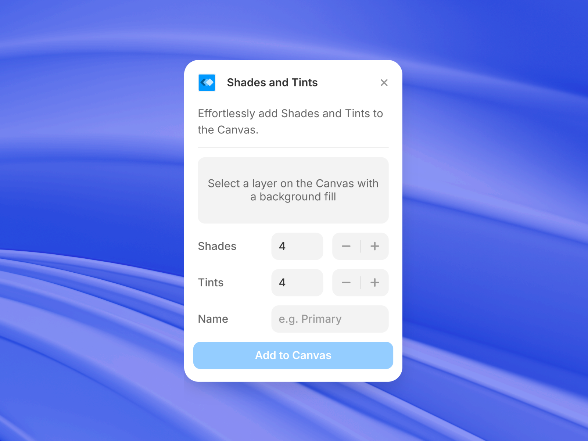

# Shades and Tints

Easily generate shades and tints then add them to the canvas.

**By**: @jhicks2306

## How it works

Select any Frame that has a background fill and then easily generate shades and tints of that color. Shades and Tints is designed to help you quickly build your color palettes in Framer.

1. Select a Frame.
2. Give it a background fill (if it does not have one already).
3. Choose your number of shades and tints.
4. Give the color set a name.
5. Add to canvas!
